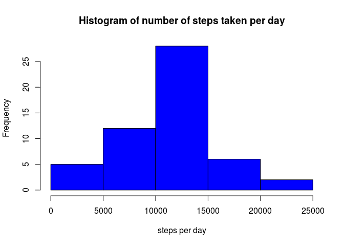
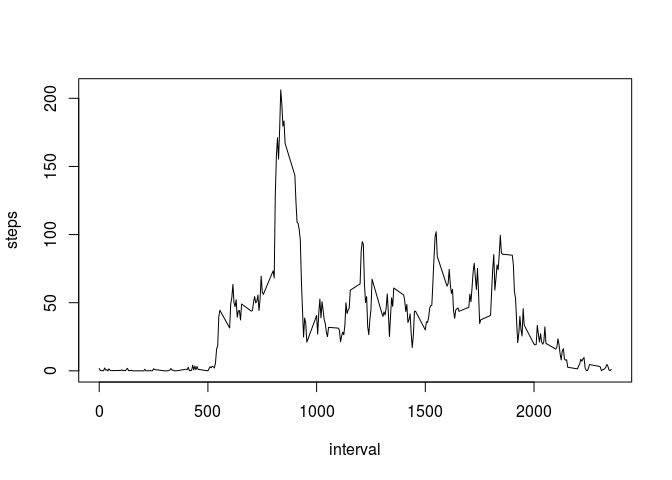
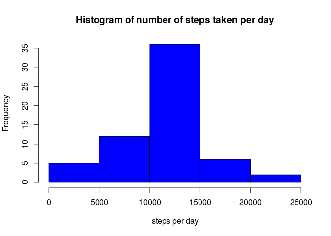
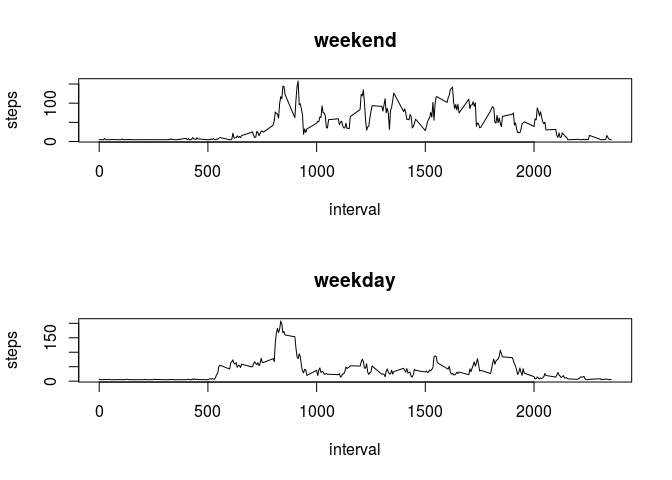

# Reproducible Research: Peer Assessment 1


## Loading and preprocessing the data


```r
df <- read.csv("activity.csv")
df$date <- as.Date(df$date)
```


## What is mean total number of steps taken per day?

###Omiting the NA values

```r
df_cc <- na.omit(df)
```

###Histogram


```r
day_steps <- aggregate(steps ~ date, data = df_cc, FUN = sum)
hist(day_steps$steps, col = "blue", main = "Histogram of number of steps taken per day", xlab = "steps per day")
```

 

###Mean and median

Mean is:

```r
mean(day_steps$steps)
```

```
## [1] 10766.19
```

Median is:


```r
median(day_steps$steps)
```

```
## [1] 10765
```

## What is the average daily activity pattern?

Time series plot of the 5-minute interval and the average number of steps taken, averaged across all days.


```r
interval_steps <- aggregate(steps ~ interval, data = df_cc, FUN = mean)
plot(interval_steps, type = "l")
```

 

Which 5-minute interval, on average across all the days, contains the maximum number of steps.


```r
interval_steps$interval[which.max(interval_steps$steps)]
```

```
## [1] 835
```

## Imputing missing values

Total number of missing values in the dataset


```r
sum(is.na(df))
```

```
## [1] 2304
```

Number of missing files in the steps column


```r
sum(is.na(df$steps))
```

```
## [1] 2304
```

New data set with NA values filled in 
(used 5-minute interval mean to impute values)


```r
df_new <- df
df_new$steps[is.na(df_new$steps)] <- mean(na.omit(df$steps))
```

###Histogram of the new data set


```r
day_steps_new <- aggregate(steps ~ date, data = df_new, FUN = sum)
hist(day_steps_new$steps, col = "blue", main = "Histogram of number of steps taken per day", xlab = "steps per day")
```

 

New mean is


```r
mean(day_steps_new$steps)
```

```
## [1] 10766.19
```

New median is


```r
median(day_steps_new$steps)
```

```
## [1] 10766.19
```

This imputing strategy does not change the mean (by construction)
it does slightly increase the median.

## Are there differences in activity patterns between weekdays and weekends?

###Differentiate weekdays and weekends in the new datset


```r
df_new$weekly[weekdays(df_new$date) %in% c("Saturday", "Sunday")]  <- "weekend"
df_new$weekly[!weekdays(df_new$date) %in% c("Saturday", "Sunday")] <- "weekday"
df_new[,4] <- as.factor(df_new[,4])
```


```r
par(mfrow = c(2, 1))
for (type in c("weekend", "weekday")) {
    interval_steps_weekly <- aggregate(steps ~ interval, data = df_new, subset = df_new$weekly == 
        type, FUN = mean)
    plot(interval_steps_weekly, type = "l", main = type)
}
```

 

